### Разбор происходящего
```
12:01:45: Executing ':JvmExperience.main()'...

> Task :compileJava UP-TO-DATE  
> Task :processResources NO-SOURCE  
> Task :classes UP-TO-DATE

> Task :JvmExperience.main()
Please open 'ru.netology.JvmExperience' in VisualVm
```
  
```
12:02:15.980269: loading io.vertx
12:02:16.396133300: loaded 529 classes
```

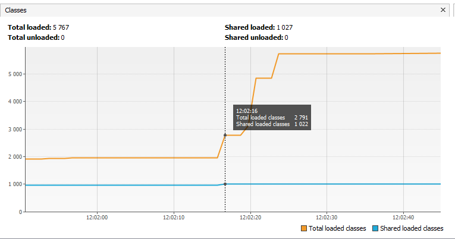
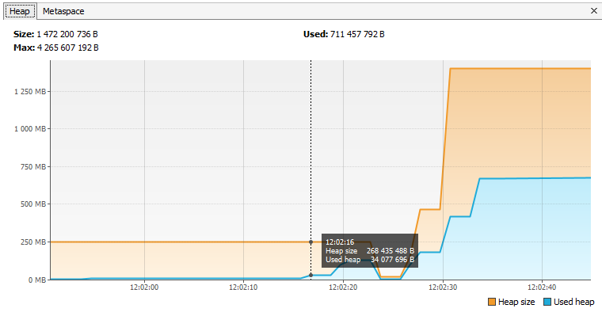
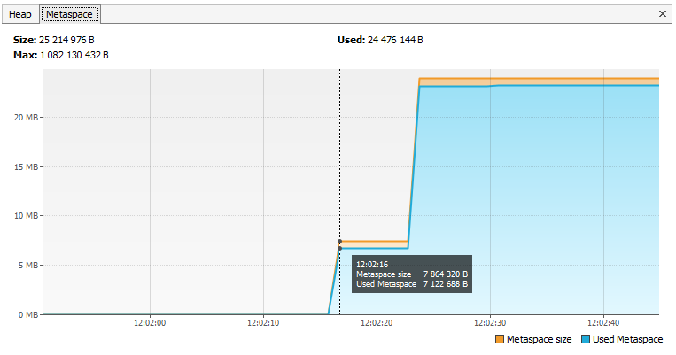

Произошла загрузка классов из пакета io.vertx в metaspace.
В итоге загружено 529 классов.<br/>
На графике Classes видно увеличение числа классов, значение на графике Heap немного подросло

---

```
12:02:19.411570500: loading io.netty
12:02:20.164562300: loaded 2117 classes
```
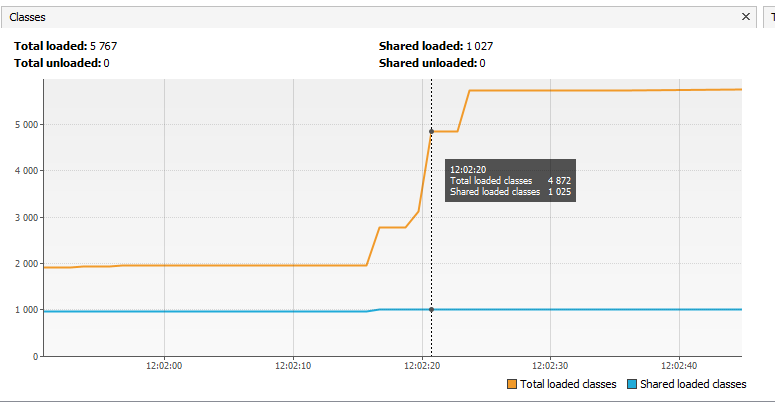
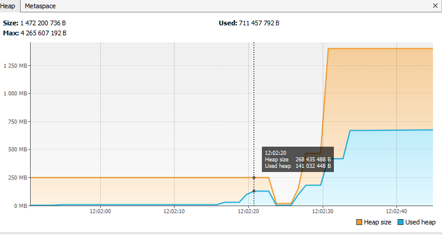
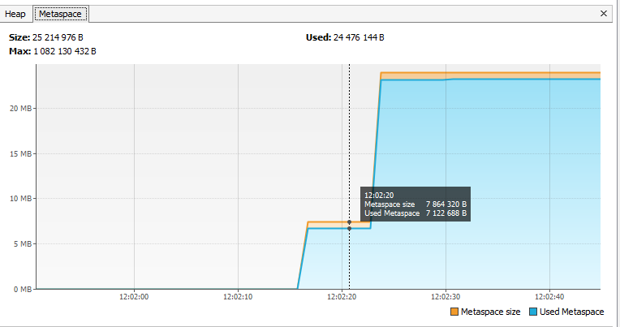

Произошла загрузка классов из пакета io.netty в metaspace.
В итоге загружено 2117 классов.<br/>
Значение на графике Classes значительно выросло, значение на графике Heap немного подросло.<br/>
Совсем не понимаю - почему не изменился Metaspace!!!

---
```
12:02:23.178865900: loading org.springframework
12:02:23.449064700: loaded 869 classes
```
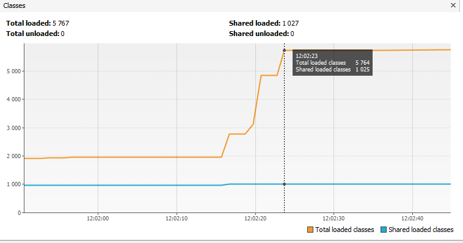
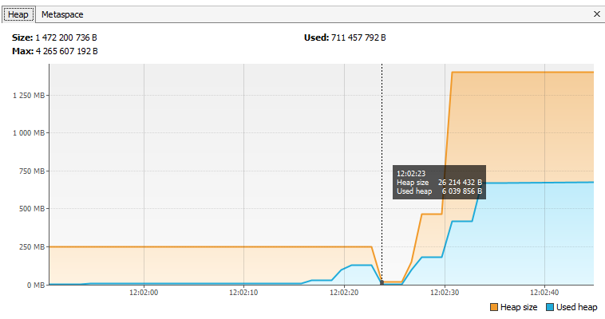
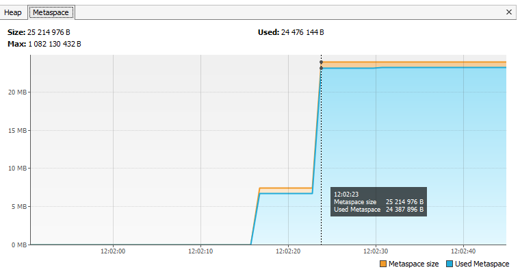

Произошла загрузка классов из пакета org.springframework в metaspace.
Загружено 869 классов<br/>
Значение Classes выросло, разумеется подрос Metaspace.<br/>
И похоже, сработал сборщик мусора, т.к. куча сократилась.

---
```
12:02:26.452968500: now see heap
12:02:26.453976800: creating 5000000 objects
12:02:26.871818200: created
```
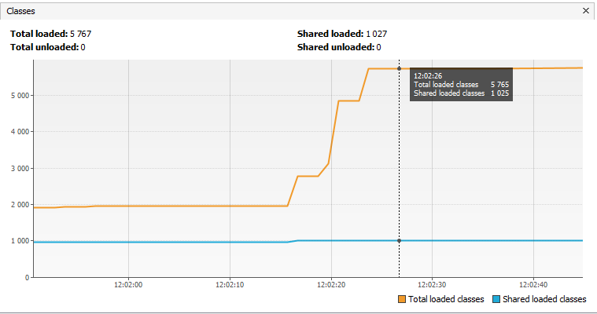
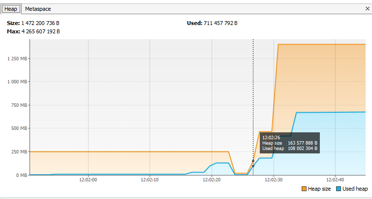
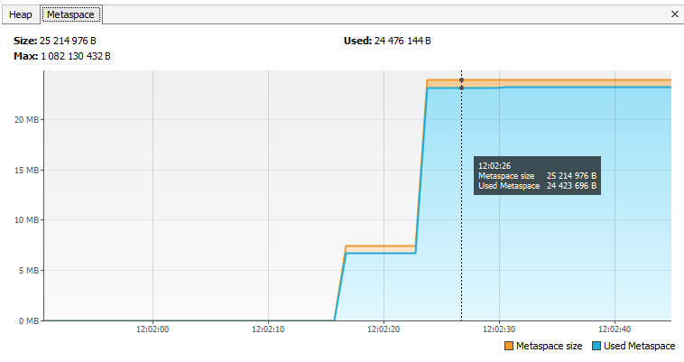

Во время создания объектов количество классов уже не растет (логично, ведь уже все загружено).<br/>
Не растет и Metaspace.<br/>
Зато куча ого как начинает изменяться...

---
```
12:02:29.883470700: creating 5000000 objects
12:02:30.142773700: created
```
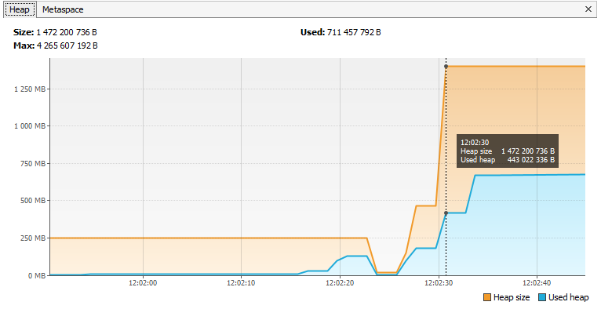

Это после очередного создания 5 миллионов объектов...

---
```
12:02:33.207857800: creating 5000000 objects
12:02:33.429269800: created
```
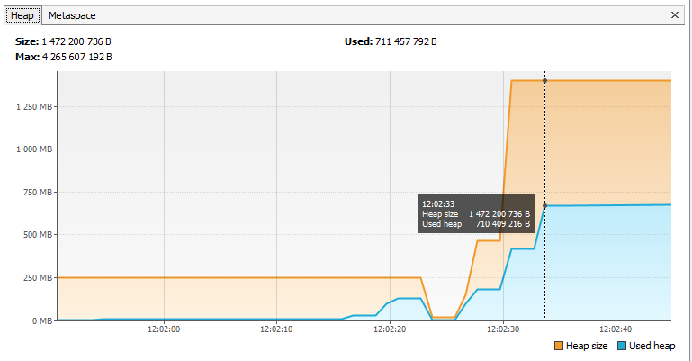

И еще после создания еще пяти миллионов объектов.

---
```
BUILD SUCCESSFUL in 51s
```

В общем программа выполнилась успешно.

---

```
2 actionable tasks: 1 executed, 1 up-to-date
12:02:36: Execution finished ':JvmExperience.main()'.
```
Ну и в целом все хорошо :)
